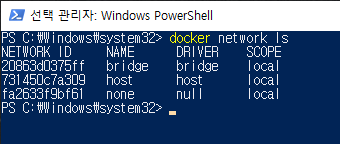
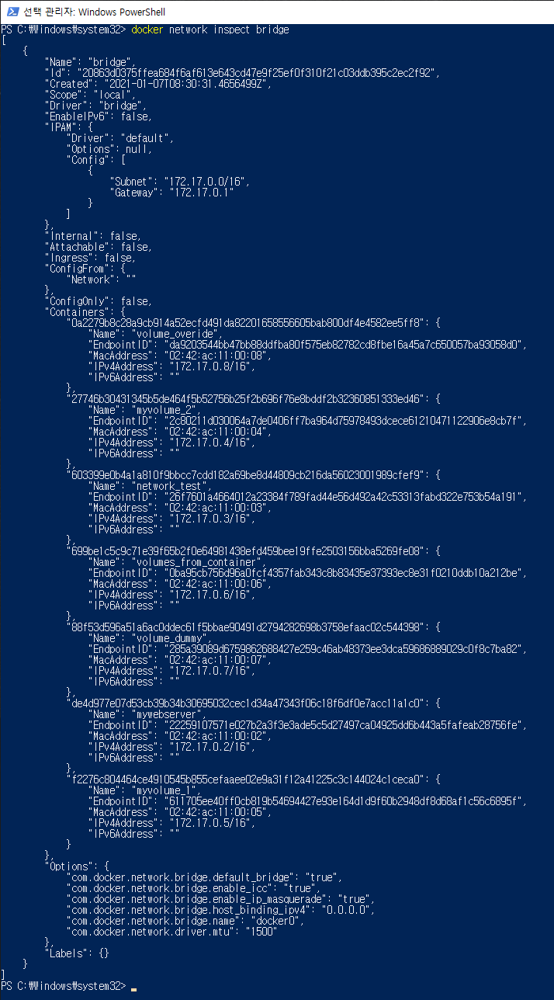

# 도커 네트워크
- 도커는 컨테이너 내부 IP를 순차적으로 할당하며, 이 IP는 컨테이너를 재시작할 때마다 변경될 수 있다.
- 이 내부 IP는 도커가 설치된 호스트(내부 망)에서만 쓸 수 있는 IP이므로 외부와 연결될 필요가 있다.
- 이 과정은 컨테이너를 시작할 때마다 호스트에 veth...라는 네트워크 인터페이스를 생성함으로써 이루어진다.
- 도커는 각 컨테이너에 외부와의 네트워크를 제공하기 위해 컨테이너마다 가상 네트워크 인터페이스를 호스트에 생성하며, 아 인터페이스의 이름은 veth로 시작한다.
- docker0라는 브리지 각 veth 인터페이스와 바인딩되어 호스트의 eth0 인터페이스와 이어주는 역할을 한다.

## 1. 도커 네트워크의 기능
- 도커가 자체적으로 제공하는 네트워크 드라이버로는 브리지, 호스트, 논, 컨테이너, 오버레이가 있다.
- 도커의 네트워크를 다루는 명령어는 `docker network`로 시작한다.

- 브리지 네트워크는 172.17.0.x IP 대역을 컨테이너에 순차적으로 할당한다.
  - `docker network inspect` 명령어로 네트워크의 자세한 정보를 알 수 있다.

## 2. 브리지 네트워크
- 컨테이너는 연결된 브리지를 통해 외부와 통신할 수 있다.
- `docker network create --driver bridge [브리지 이름]` 명령어로 새로운 브리지 네트워크를 생성할 수 있다.
- docker run이나 docker create 명령어에 `--net [브리지 이름]` 옵션으로 컨테이너가 해당 네트워크를 사용하도록 설정할 수 있다.
- 결과적으로, 컨테이너에 새로운 IP 대역이 할당된다.
- 이렇게 생선된 네트워크는 `docker network [disconnect 혹은 connect} [브리지 이름] [컨테이너 이름]` 명령어로 컨테이너와 떼거나 붙일 수 있다.
  - 이 명령어는 논 네트워크나 호스트 네트워크에는 사용할 수 없다.
  - 브리지 네트워크나 오버레이 네트워크와 같이 특정 IP 대역을 갖는 네트워크 모드에만 사용할 수 있다.
- 네트워크를 생성할 때 `--subnet`, `--ip-range`, `--gateway` 옵션으로 네트워크의 서브넷, IP 범위, 게이트웨이의 주소를 설정할 수 있다.

## 3. 호스트 네트워크
- 네트워크를 호스트로 설정하면 호스트의 네트워크 환경을 그대로 사용할 수 있다.
- 네트워크를 별도로 생성하지 않고, 기존의 host라는 이름의 네트워크를 사용한다.
  - `--net host`
- 호스트 네트워크로 설정하면, 컨테이너 내부의 애플리케이션을 별도의 포트포워딩 없이 바로 사용할 수 있다.

## 4. 논 네트워크
- 아무런 네트워크를 사용하지 않는다.
  - 외부와 연결이 단절된다.
  - `--net none`

## 5. 컨테이너 네트워크
- 다른 컨테이너의 네트워크 네임스페이스 환경을 공유한다.
  - `--net container:[공유될 컨테이너의 이름]`
  - 내부 IP와 MAC 주소 등이 공유된다.

## 6. 브리지 네트워크와 --net-alias
- run 명령어에서 브리지 네트워크 옵션과 `--net-alias [특정 호스트 이름]` 옵션을 함께 쓰면 특정 호스트 이름으로 컨테이너 여러 개에 접근할 수 있다.
- 이렇게 생성된 컨테이너의 IP는 DNS 서버에 그 특정 호스트의 이름으로 등록된다.

## 7. MacVLAN 네트워크
- 호스트의 네트워크 인터페이스 카드를 가상화해 물리 네트워크 환경을 컨테이너에게 동일하게 제공한다.
  - `docker network create --driver macvlan [서버의 서브넷, IP, 게이트웨이 주소] -o macvlan_mode[네트워크 모드] -o parent=[부모 네트워크의 인터페이스] [네트워크 이름]`
- 컨테이너는 물리 네트워크상에서 가상의 MAC 주소를 가지며, 해당 네트워크에 연결된 다른 장치와의 통신이 가능해진다.
  - MacVLAN에 연결된 컨테이너는 기본적으로 할당되는 IP 대역인 172.17.x.x 대신 네트워크 장비의 IP를 할당받기 때문이다.
- MacVLAN 네트워크를 사용하는 컨테이너는 기본적으로 호스트와 통신이 불가능하다.